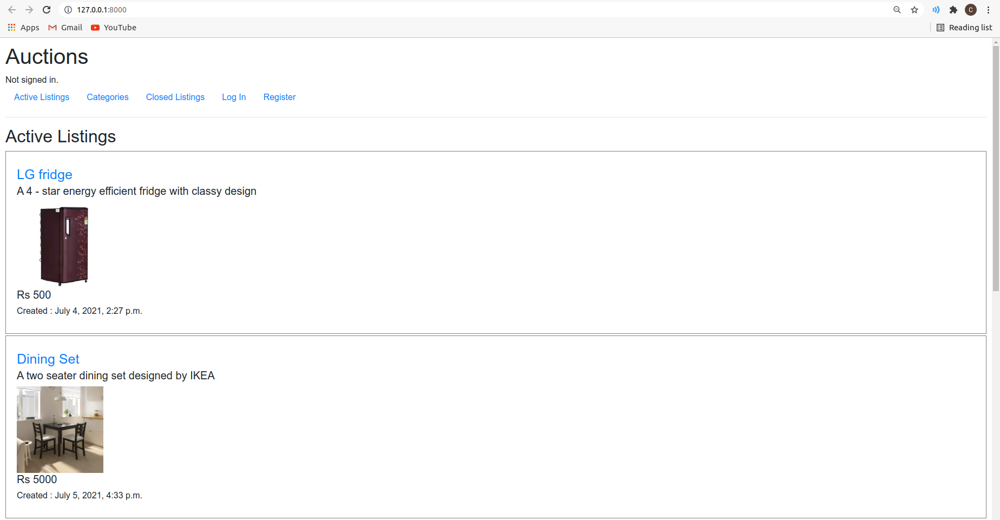
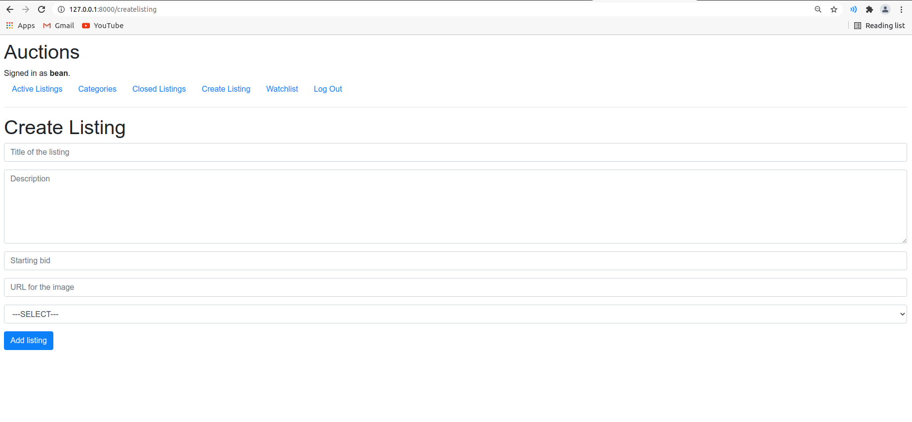
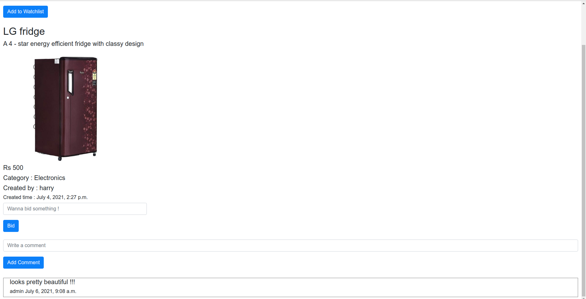
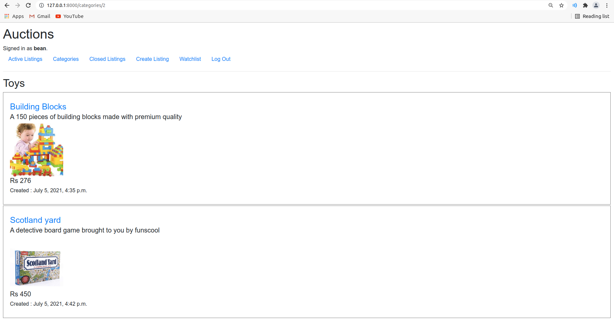
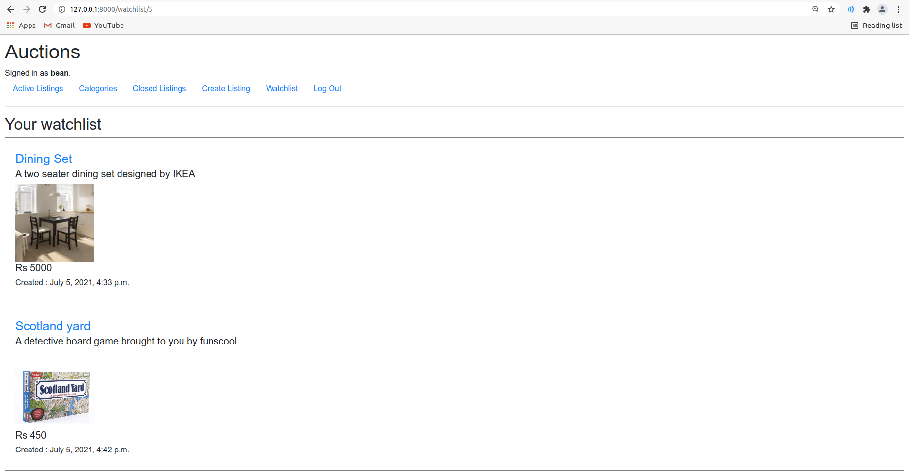

# Commerce Web Application

After cloning the repository
In your terminal, 
Run `python3 manage.py runserver` to localhost the application 

**Models**: Application  have four models in addition to the User model: one for auction listings,one for category, one for bids, and one for comments made on auction listings. 

**Create Listing**: Users are able to visit a page to create a new listing. They are able to specify a title for the listing, a text-based description, and what the starting bid should be. Users can provide a URL for an image for the listing and/or a category (e.g. Fashion, Toys, Electronics, Home, etc.).

**Active Listings Page**: The default route of web application let users view all of the currently active auction listings. For each active listing, this page displays the title, description, current price, and photo (if one exists for the listing).

**Listing Page**: Clicking on a listing take users to a page specific to that listing. On that page, users are able to view all details about the listing, including the current price for the listing.
- If the user is signed in, the user is able to add the item to their “Watchlist.” If the item is already on the watchlist, the user is able to remove it.
- If the user is signed in, the user is able to bid on the item. The bid must be at least as large as the starting bid, and must be greater than any other bids that have been placed (if any). If the bid doesn’t meet those criteria, the user is presented with an error.
- If the user is signed in and is the one who created the listing, the user have the ability to “close” the auction from this page, which makes the highest bidder the winner of the auction and makes the listing no longer active.
- If a user is signed in on a closed listing page, and the user has won that auction, the page say so.
- Users who are signed in are able to add comments to the listing page. The listing page display all comments that have been made on the listing.

**Watchlist**: Users who are signed in are able to visit a Watchlist page, which should display all of the listings that a user has added to their watchlist. Clicking on any of those listings take the user to that listing’s page.

**Categories**: Users are able to visit a page that displays a list of all listing categories. Clicking on the name of any category takes the user to a page that displays all of the active listings in that category.

**Django Admin Interface**: Via the Django admin interface, a site administrator is able to view, add, edit, and delete any listings, comments, and bids made on the site.

## Screenshots

***Home Page***

***Create Listing Page***

***Listing Page***

***Toys Category Page***

***Watchlist Page***

